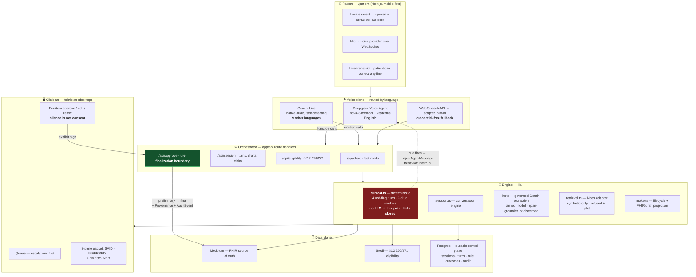
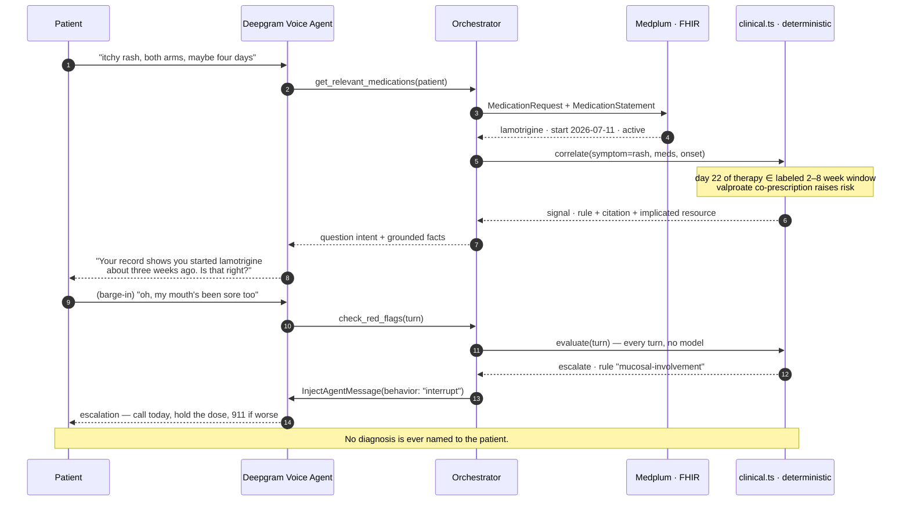

<div align="center">

<h1>Prologue</h1>

<p><em>The visit starts before the visit.</em></p>

<p><b>A voice intake that has already read your chart — so it catches what you didn't know to mention.</b></p>

[](https://ycombinator.com)
[](https://ycombinator.com)
[](#what-this-is-not-claiming)

<br/>

<sub><b>POWERED BY OUR SPONSORS</b></sub>

[](https://www.medplum.com)
[](https://deepgram.com)
[](https://www.stedi.com)
[](https://ai.google.dev)
[](https://usemoss.dev)

<br/>

### A rash, a prescription three weeks old, and nothing in the patient's care connecting them. Prologue asks the question that connects them — computed from the chart, never scripted.

<br/>


</div>

---

> **In one sentence:** A patient talks for five minutes before their appointment; because the agent has already loaded their FHIR record, it asks follow-ups a form structurally cannot, evaluates deterministic safety rules every turn, and hands the clinician a provenance-separated **draft** that becomes part of the record only when a human approves it item by item.

**Contents** — [Problem](#the-problem) · [The moment](#the-moment) · [Why it's defensible](#why-its-defensible) · [Architecture](#architecture) · [Sponsors](#sponsors--how-we-use-them) · [Safety model](#safety-model) · [FHIR model](#fhir-data-model) · [Voice routing](#voice-routing--and-why) · [Real vs simulated](#real-vs-simulated) · [Getting started](#getting-started) · [Repo structure](#repository-structure) · [Not claiming](#what-this-is-not-claiming) · [Roadmap](#roadmap)

---

## The Problem

| | |
|---|---|
| **18 seconds** | How long before a physician interrupts a patient's opening statement. Only **23%** ever finish it, and interrupted concerns are almost never revisited. ([Beckman & Frankel](https://pmc.ncbi.nlm.nih.gov/articles/PMC1783704/)) |
| **67% / 91%** | Up to two-thirds of patients have an error in their medication history — and **91% of discrepancies are omissions**, traceable to *how the history was taken*. ([PMC2518028](https://pmc.ncbi.nlm.nih.gov/articles/PMC2518028/)) |
| **2:1** | Hours of EHR and desk work per hour of face time, inside a ~18-minute average visit. ([Sinsky, *Annals*](https://www.acpjournals.org/doi/10.7326/M16-0961)) |
| **~49%** | How much of a visit patients recall. Only **12% of US adults** have proficient health literacy. |

**The pre-visit window is the only moment in the encounter with unlimited time and zero clinical attention.** Today it is spent on a form that cannot ask a second question.

---

## The Moment

**Maria Delgado, 34.** Bipolar II, managed by psychiatry. On divalproex for two years. Started **lamotrigine 22 days ago**. Books primary care for *"an itchy rash on my arms and chest."*

> **Maria:** "…both arms and some on my chest. Itchy. Maybe four days?"
>
> **Prologue:** "That helps. One thing I want to check — and it may be nothing. Your record shows you started lamotrigine about three weeks ago. Is that right?"
>
> **Maria:** "Yeah, my psychiatrist added it last month."
>
> **Prologue:** "Okay. A rash in the first couple of months on lamotrigine is something clinicians want to look at quickly — that's in the drug's own labeling. I'd rather someone from Dr. Osei's office call you today than wait for Thursday."

Then she interrupts mid-sentence — *"oh, my mouth's been sore too."* **Mucosal involvement is a red flag.** The agent stops talking, abandons the script, and escalates.

**Why this scenario.** Lamotrigine carries an **[FDA boxed warning](https://www.accessdata.fda.gov/drugsatfda_docs/label/2025/022115s031s032lbl.pdf)** for life-threatening rash (SJS/TEN). Serious rash *"almost always occurred within **2–8 weeks**"* of initiation, and risk is **increased by concomitant valproate** — which is why she is on divalproex. She is 22 days in.

Maria had no idea those two facts were related. Different doctor, different problem, different month. **Nothing in her care connects them** — not the scheduler, not the intake form, not her memory.

**The agent never names a diagnosis.** It routes urgency to the clinic, not alarm to the patient. That is the entire safety model in a single exchange.

---

## Why It's Defensible

| Category | Pre-visit window? | Reads the chart? | Can ask follow-up *n+1*? |
|---|:---:|:---:|:---:|
| **Intake forms** — Phreesia (~170M visits/yr), Luma, Notable | ✅ | ❌ | ❌ |
| **Symptom checkers** — Ada, K Health, Buoy, Infermedica | ✅ | ❌ | ✅ |
| **Ambient scribes** — Abridge, Ambience, Suki, Nabla | ❌ *arrive in-room* | ✅ | n/a |
| **Voice agents** — Assort, Hyro, Hello Patient | ✅ | ❌ | *scheduling only* |
| **Prologue** | ✅ | ✅ | ✅ |

A form is a fixed graph — it cannot ask question *n+1* based on answer *n*. Symptom checkers reason but are chart-blind, with a published ceiling of **19–37.9%** primary-diagnosis accuracy. Ambient scribes have the chart but arrive after the patient is already in the room.

> **The way through isn't better diagnosis — it's refusing to diagnose at all.** A tool that *surfaces information for a clinician to review* sidesteps the liability wall that keeps everyone else administrative.

---

## Architecture



### The chart-conditioned question, end to end



**Design decisions and their reasons**

- **Reads are client-side functions** — removes a network hop from the turn budget (target: perceived turn **< 1.2s**, chart retrieval **< 100ms**).
- **Eligibility is server-side** — a slow write holding a credential does not belong in the turn loop.
- **Safety is not a model.** `lib/clinical.ts` is a rule list a judge can read. Evaluation errors escalate rather than silently passing.
- **One agent, not many.** Multiple agents are justified only where independent verification produces *visible* value.

---

## Sponsors & How We Use Them

| Sponsor | Badge | How Prologue uses it |
|---|---|---|
| **Medplum** | [](https://www.medplum.com) | **FHIR source of truth and the finalization target.** `lib/medplum.ts` reads `Condition`, `AllergyIntolerance`, `MedicationRequest`, `MedicationStatement`, and `Encounter`; `lib/intake.ts` projects the StoryMap into `Observation`, `DetectedIssue`, `QuestionnaireResponse`, `Composition`, `Provenance`, and `AuditEvent`. We follow Medplum's documented [**"can suggest, but not act"**](https://www.medplum.com/docs/ai) pattern — the agent's identity writes drafts only. Approval writes `preliminary → final` with an attestation trail and per-resource `WriteReceipt` entries (`written` / `not-attempted` / `failed`). |
| **Deepgram** | [](https://deepgram.com) | **The English voice path, over one WebSocket.** `nova-3-medical` for STT with **`keyterms` preloaded from the patient's own eight medications** — a closed vocabulary, and the strongest mitigation in the stack against *lamotrigine* transcribing wrong. `aura-2-thalia-en` for ~90ms TTS, `eot_threshold` tuned for turn-taking. **The detail worth pointing at:** when a deterministic rule fires we call `InjectAgentMessage` with `behavior: "interrupt"` — safety cuts the model off mid-word rather than asking it to comply. `LatencyReport` and `AgentStartedSpeaking` mean the header's turn/STT/TTS figures are **measured, not estimated**. |
| **Stedi** | [](https://www.stedi.com) | **Real X12 eligibility, mapped through Medplum's [Stedi integration](https://www.medplum.com/docs/integration/stedi)** to `CoverageEligibilityRequest` / `Response`. The check runs *because* the visit just moved up — one narrative, not two features. `lib/stedi.ts` reads benefit values **from the 271 only**; a missing benefit is declared missing, never backfilled. |
| **Google Gemini** | [](https://ai.google.dev) | **Two roles.** (1) `lib/gemini-live.ts` — `gemini-3.1-flash-live-preview` native audio is the **non-English voice path**; these models detect and switch language themselves and reject an explicit language code, so the patient can switch mid-call. (2) `lib/llm.ts` — a **governed extraction layer** on a *pinned* model (`gemini-3.6-flash`, `PROMPT_VERSION` persisted with every fact) that proposes candidate structured facts from one committed turn. **Every fact must be grounded in an exact span of the source turn; ungrounded facts are discarded, not surfaced with a low score.** It never decides red-flag truth, severity, disposition, or finality. |
| **InferEdge Moss** | [](https://usemoss.dev) | **Patient-scoped chart retrieval behind an explicit PHI gate.** `lib/retrieval.ts` documents what we found inspecting the published bundle: Moss is **not local** — documents are uploaded and index construction runs at InferEdge. So `assertRetrievalAllowed()` **refuses to index any document not marked synthetic, and refuses Moss outright in pilot mode.** Production chart retrieval stays on authorized deterministic Medplum reads; when Moss is unavailable the product reports retrieval as *unavailable* and never substitutes fixture data. |

---

## Safety Model

| Safeguard | Enforced how |
|---|---|
| **Consent** | Spoken + on-screen before any capture; persistent recording indicator; writes a `Consent` resource. Nothing is captured before affirmative consent. |
| **No diagnosis, ever** | No condition name reaches the patient. Asserted in tests against a **forbidden-terms regex across every rule and every locale**. |
| **Deterministic escalation** | 4 red-flag rules (`mucosal-involvement`, `blistering-peeling`, `systemic-symptoms`, `airway-breathing`) checked **every turn, by code, not a model**. Evaluation error → **escalate**. Negation and history are handled ("not sore", "denies", "last year" do not fire). |
| **Draft vs final** | `writeDraft()` **throws** on `status: final` or `completed`. The **only** path to `final` is the clinician approval handler. There are tests that try to violate this. |
| **Explicit approval** | Every promotable item needs an explicit **approve / edit / reject**. A partially reviewed packet is refused with **422** rather than promoting itself. **Silence is not consent.** |
| **Rejection is real** | A rejected finding **never** becomes a `DetectedIssue` or any clinical resource — it stays auditable in the StoryMap and the `AuditEvent`. |
| **Server-authoritative finality** | Client-supplied `compositionStatus`, `approvedBy`, or `approvedAt` is **discarded on ingest**. Approval is idempotent — replay returns the original signature. A signed session is terminal. |
| **Provenance separation** | Six labels, never blended: `● PATIENT` `● RECORD` `● EVIDENCE` `● INSURANCE` `◐ INFERRED` `✓ CLINICIAN`. **An uncited inference cannot be promoted.** |
| **Prompt injection** | Patient speech is **data, never instructions** — delimited, schema-validated arguments. No function can escalate privilege. **Blast radius is a bad draft, which a clinician rejects.** |
| **Honest degradation** | Degradation **removes claims**; it never fabricates them. An empty live chart is reported **empty**. A 271 missing a benefit declares it **missing**. Neither is backfilled from the fixture. |
| **Language ≠ coverage** | Safety rules are validated for **English only** (`SAFETY_RULE_LOCALES`). A non-English intake records a **visible coverage gap** — *"not screened" is never presented as "nothing found."* Adding a UI language does not add safety coverage. |
| **No audio** | **Nothing is recorded or stored.** The clinician's "read aloud" control says it synthesises speech from the transcript. |

---

## FHIR Data Model

| Event | Resource | State | Needs approval |
|---|---|---|:---:|
| Recording consent | `Consent` | active | — |
| Interview answers | `QuestionnaireResponse` | in-progress → completed | on promotion |
| Confirmed symptom | `Observation` | **preliminary** | ✅ → `final` |
| Suspected condition | `Condition` | — | ✅ **clinician only** |
| Patient-reported meds | `MedicationStatement` | draft | ✅ |
| Prescribed meds | `MedicationRequest` | active *(read-only to us)* | — |
| **Drug-safety signal** | **`DetectedIssue`** — `code = DRG`, `implicated` → the MedicationStatement | **preliminary** | ✅ |
| Pre-visit brief | `Composition` | **preliminary** | ✅ → `final` |
| Eligibility | `CoverageEligibilityRequest` → `Response` | active | — |
| Review assignment | `Task` | requested → completed | — |
| Attestation / audit | `Provenance`, `AuditEvent` | immutable | — |

**Three rules.**

1. **`Composition.status` reaches `final` only from the approval handler.** No other code path writes it, and a test tries to.
2. **The agent never creates a `Condition`.** Asserting a condition is a clinical act. The agent produces `Observation` (what was observed) and `DetectedIssue` (what warrants attention).
3. **`MedicationStatement` ≠ `MedicationRequest`.** What the patient says they take vs. what was prescribed. **The gap between them is where 91% of harmful discrepancies live.** Reconciliation makes the gap visible; it never overwrites either source.

> **FHIR validity is not clinical correctness.** A schema-valid `Observation` can be completely wrong. Validation buys interoperability; the clinician gate buys safety.

---

## Voice Routing — and Why

| Language | Provider | Why this one |
|---|---|---|
| **English** | **Deepgram Voice Agent** — `nova-3-medical` + `keyterms` | The largest live risk is a drug name transcribing wrong. *Metoprolol* and *metolazone* differ by one phoneme and are unrelated drugs; *lamotrigine* is the word the whole demo turns on. Keyterm prompting over **this patient's own eight medications** is a closed vocabulary. |
| **9 others** | **Gemini Live** — `gemini-3.1-flash-live-preview` | Native-audio models detect and switch language themselves and reject an explicit language code. Deepgram needs the language declared up front; Gemini follows the patient mid-call. |

**Ten UI languages:** English, Español, 中文, Tiếng Việt, हिन्दी, العربية (RTL), Tagalog, Português, Русский, Français.

> The **patient** hears and reads their own language. The **clinical record** is always English. The patient's **original words are preserved verbatim** and are one click from the clinician — because a translated summary is an interpretation, and the clinician must be able to reach what was actually said.

### Fallbacks, in order — each level removes capability, never truthfulness

```
1. Deepgram unavailable ──────► English falls through
2. Gemini unavailable ────────► non-English falls through
3. Neither ───────────────────► Web Speech API (real mic, no credentials)
4. No mic / noisy room ───────► scripted button — only Maria's WORDS are canned;
                                the chart read, correlation, red-flag evaluation
                                and the agent's question are still computed
5. Medplum unavailable ───────► synthetic fixture, badged FIXTURE
6. Stedi unavailable ─────────► fixture benefits, badged FIXTURE
7. Everything down ───────────► the timeline visual still makes the argument
```

---

## Real vs Simulated

Every screen says which. Nothing is implied.

| | Status |
|---|---|
| Chart-conditioned question | **Real, always.** Computed from the record. Never scripted, in any mode |
| Temporal correlation & risk windows | **Real.** Hand-curated, cited drug table (3 entries) |
| Red-flag rules | **Real, deterministic, fails closed** (4 rules) |
| Provenance separation & the approval gate | **Real.** `writeDraft()` throws on `status: final` |
| Governed extraction | **Real, span-grounded.** Ungrounded facts discarded |
| Durable control plane | **Real** when `DATABASE_URL` is set — write-through Postgres |
| Patient history | Synthetic fixture (live with Medplum keys) |
| Coverage | Fixture (live 270/271 with a Stedi key) |
| Maria's spoken lines in scripted mode | Canned — and labeled as such |
| Safety coverage in non-English locales | **None.** Flagged as unscreened |
| Patient audio | **Never recorded** |

⚠️ **Verified Stedi test-mode constraint:** 270/271, 837, 835, 277CA only — **no 278 prior auth, no 276/277**. Mock payers limited to Aetna, Cigna, UnitedHealthcare, CMS, and **custom mock data is unsupported**, so the synthetic patient is built to match Stedi's fixture rather than the reverse.

That constraint forces the honest framing anyway:

| Claim | Can a 271 support it? |
|---|:---:|
| "Your Aetna plan is active" | ✅ |
| "This visit is covered under your office-visit benefit" | ✅ |
| "You've met $660 of your deductible" | ✅ |
| **"This will cost you $340"** | ❌ **never** |
| **"This requires prior authorization"** | ❌ **never** |

---

## Getting Started

```bash
npm install
npm run dev          # http://localhost:3000
```

**No credentials required.** With no keys the app runs on a deterministic synthetic fixture and every screen labels itself `FIXTURE` rather than implying a live backend. That is the demo guarantee, not a degraded mode.

| Route | |
|---|---|
| **`/patient`** | Mobile-first voice check-in — open this on an actual phone |
| **`/clinician`** | Desktop review, three-pane packet, and the approval gate |
| **`/prove`** | **Hand this to a judge** — change a fact, watch the question change |

### Verify

```bash
npm test        # 110 passing, 14 skipped (Postgres-gated) across 9 suites
npm run typecheck
npm run build
```

### Going live

Copy `.env.example` to `.env.local`. Each key is independent — Stedi alone makes coverage live while the chart stays fixture.

| Variable | Effect when present |
|---|---|
| `MEDPLUM_CLIENT_ID` + `MEDPLUM_CLIENT_SECRET` | Chart reads hit a real Medplum project; drafts written as real FHIR |
| `STEDI_API_KEY` | Real X12 270/271; badge flips `FIXTURE` → `LIVE 270/271` |
| `DEEPGRAM_API_KEY` | Deepgram Voice Agent becomes the English path |
| `GEMINI_API_KEY` | Gemini Live becomes the non-English path |
| `GEMINI_EXTRACT_MODEL` | Governed extraction; absent = no extraction (never a guess) |
| `MOSS_PROJECT_ID` / `MOSS_PROJECT_KEY` | Moss retrieval over **synthetic records only** |
| `DATABASE_URL` | Durable control plane (Postgres); **required in pilot mode** |
| `PROLOGUE_MODE` | `demo` (default) permits labeled fixtures. **`pilot` refuses to substitute synthetic clinical or payer data** |
| `PROLOGUE_CLINICIAN_SECRET` | Required in pilot. **A browser alone cannot finalize clinical data** |

```bash
npm run seed      # seed Maria Delgado into Medplum (with medication start dates)
npm run migrate   # apply Postgres migrations
```

> **Two-device demo.** Open `/patient` on a phone and `/clinician` on a laptop against the same server. The story map is held server-side, so the packet fills in on the laptop as the call proceeds on the phone. Full beat-by-beat script in **[RUNNING.md](RUNNING.md)**.

---

## Repository Structure

| Path | Role |
|---|---|
| `app/patient/page.tsx` | Patient intake and voice-mode orchestration |
| `app/clinician/page.tsx` | Clinician review, three-pane packet, approval UI |
| `app/prove/page.tsx` | Interactive proof the question is **computed, not scripted** |
| `app/api/approve/route.ts` | **The finalization boundary.** Server-authoritative, idempotent |
| `app/api/{chart,session,eligibility}/route.ts` | Fast reads, lifecycle + draft writes, 270/271 |
| `lib/clinical.ts` | **Deterministic** drug-correlation and red-flag logic. No LLM in this path |
| `lib/session.ts` | Shared conversation engine |
| `lib/intake.ts` | Lifecycle, FHIR draft projection, finalization transaction |
| `lib/llm.ts` | Governed Gemini extraction — pinned model, span-grounded |
| `lib/retrieval.ts` | Moss adapter + the synthetic-only PHI gate |
| `lib/deepgram-live.ts` · `lib/gemini-live.ts` · `lib/voice.ts` | Live and fallback voice paths |
| `lib/medplum.ts` · `lib/stedi.ts` | FHIR and eligibility adapters with **labeled** fixture fallback |
| `lib/durableStore.ts` · `lib/db/` | Write-through Postgres control plane |
| `lib/types.ts` | The single `StoryMap` both views read |
| `lib/i18n.ts` | Ten locales; engine strings, not transcribed speech |
| `tests/adversarial.test.ts` | **Executable claim audit** for the failure modes most likely to destroy clinical trust |
| `docs/00-DECISION-LOG.md` | Every idea generated and killed, and why |
| `docs/01-PRODUCT-DESIGN.md` | Full design spec |
| `docs/research/` | Sourced FHIR, market, sponsor, safety, and regulatory evidence |

---

## What This Is NOT Claiming

Honest framing matters more than a flashy number.

- **Not HIPAA compliant, and we don't claim to be.** Synthetic data only — stated out loud in the first 20 seconds of the demo.
- **Not a clinical system.** A hackathon prototype built around one synthetic patient. Patient, appointment, clinician, and coverage details are still tied to the Maria Delgado fixture in several runtime paths.
- **The durable FHIR write is unverified against a live Medplum project.** With no credentials the transaction runs, records every resource as `not-attempted` with no id, and warns that nothing was persisted. In pilot mode it refuses outright.
- **Identity is a static server-side roster**, not authentication or Medplum-enforced RBAC. It exists so finalization has a server-side gate at all. SSO/RBAC is required before real PHI.
- **Drug knowledge is 3 hand-curated entries.** A demonstration of the mechanism, not a formulary.
- **Ten UI languages is not ten languages of safety coverage.** Non-English intakes are flagged unscreened.
- **Clinician-facing translation is not implemented.** A Spanish speaker's words are shown to the clinician tagged `original · es-US`. Showing a machine translation *as* the clinical record, with no path back to the source, would be worse.
- **Moss is gated, not deployed.** Blocked for real PHI: no BAA, and its own README forbids production use while its LICENSE contradicts that.
- **The queue API orders escalations first, but the clinician screen still opens the latest session** rather than presenting the queue with stable detail routes.
- **No image classification.** That is the line between a documentation aid and a regulated device.

**Deliberately moved to roadmap:** *"n=1 treatment customized just for you."* A patient-facing individualized treatment recommendation, produced before any clinician is involved, plausibly falls outside the FDA's Non-Device CDS carve-out — which requires the intended *clinician* user to independently evaluate the basis. **Prologue produces questions for the physician instead.**

---

## Roadmap

1. Verify the finalization transaction against a real Medplum project and record live `WriteReceipt` ids.
2. Replace the static roster with SSO + Medplum-enforced AccessPolicy before any real PHI.
3. Present the clinician **queue** with stable detail routes and assignment, not "latest session".
4. Clinician-facing translation with source-linked correction history back to the original audio-free transcript.
5. Expand deterministic safety rules beyond English — write and test them, don't infer them.
6. Grow the curated drug-window table into a maintained, cited knowledge source with a review process.

---

## Team

Built at the **YC × Medplum Agentic Healthcare Hackathon** — Aug 1, 2026, Y Combinator SF.

The design was produced adversarially: an ideator generating candidates, a researcher verifying every factual claim against primary sources, and a devil's advocate whose only job was to kill ideas. **It was right three times against the lead's position.** Six reversals are recorded in [the decision log](docs/00-DECISION-LOG.md) — including *"skip the 271 and fire a 278"*, which turned out to be impossible because Stedi test mode does not support 278 at all.

> The conclusion is worth less than the reasoning. That is why the killed ideas are still in the repo.

## Acknowledgements

- **[Medplum](https://www.medplum.com)** — the FHIR platform, the Stedi integration path, and the ["can suggest, but not act"](https://www.medplum.com/docs/ai) pattern we built to rather than inventing our own.
- **[Y Combinator](https://ycombinator.com)** — host of the Agentic Healthcare Hackathon.
- **[Deepgram](https://deepgram.com)** — Voice Agent API, `nova-3-medical`, keyterm prompting, and wire-level interrupt control.
- **[Stedi](https://www.stedi.com)** — X12 270/271 eligibility in test mode.
- **[Google Gemini](https://ai.google.dev)** — Live native-audio multilingual voice and the governed extraction model.
- **[InferEdge Moss](https://usemoss.dev)** — patient-scoped retrieval over synthetic records.

---

<div align="center">
<sub><b>Prototype on synthetic data. Not a medical device. Not HIPAA compliant. No license file yet.</b></sub>
</div>
